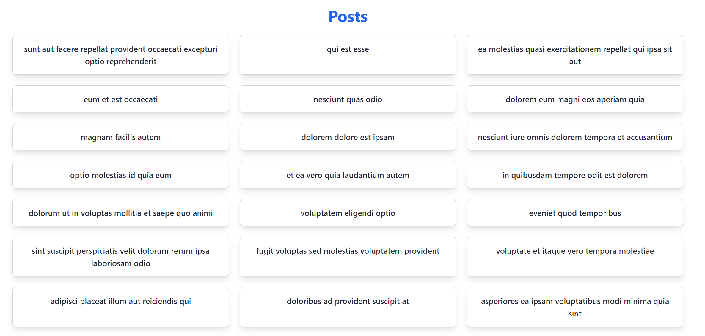

# 📚 Posts App

Uma aplicação Next.js simples que lista posts de uma API pública e permite a visualização dos detalhes de cada post. A estilização é feita com TailwindCSS para um design moderno e responsivo.



## 🚀 Tecnologias Utilizadas

- **Next.js**: Framework React para renderização do lado do servidor e geração de páginas estáticas.
- **TailwindCSS**: Framework CSS utilitário para estilização rápida e responsiva.
- **TypeScript**: Linguagem que adiciona tipagem estática ao JavaScript.

## 🛠️ Como Começar

Siga os passos abaixo para rodar a aplicação localmente:

### 1. Clonar o Repositório

```bash
git clone https://github.com/seu-usuario/posts-app.git
cd posts-app
```

### 2. Instalar Dependências

Execute o seguinte comando para instalar as dependências do projeto:

- npm install

### 3. Rodar a Aplicação

Agora você pode iniciar o servidor de desenvolvimento:

- npm run dev

A aplicação estará disponível em http://localhost:3000.

## 📖 Funcionalidades

Listagem de Posts: Visualize uma lista de posts com título.
Detalhes do Post: Clique em um post para visualizar seu título e conteúdo.
Design Responsivo: A aplicação é otimizada para funcionar em diferentes tamanhos de tela.
